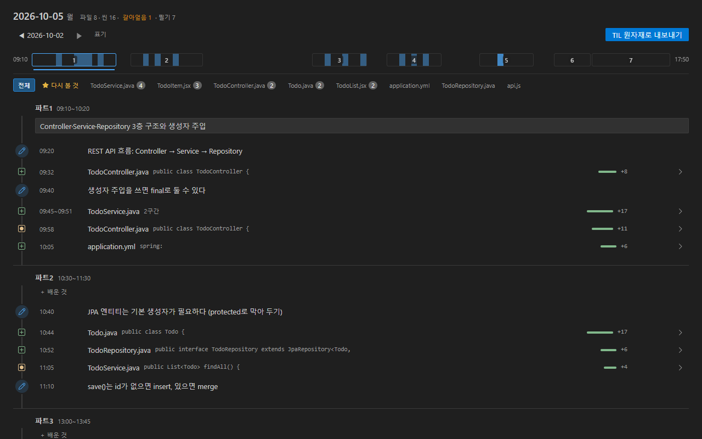
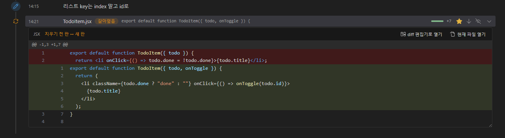

# 수업 리플레이 (Lesson Replay)

[](https://marketplace.visualstudio.com/items?itemName=bapzzi.lesson-replay)
[](https://marketplace.visualstudio.com/items?itemName=bapzzi.lesson-replay)
[](LICENSE)

코드를 저장할 때마다 자동으로 기록하고, 하루 끝에 시간순으로 복기하고, TIL 재료까지 만들어 주는 VS Code 확장.



## 쓰는 사람

- 부트캠프·학원·대학 강의에서 라이브 코딩을 따라 치는 사람
- 혼자 공부하면서 오늘 한 일을 정리해 두고 싶은 사람
- Java·Python·JavaScript·SQL 등 어떤 언어든

## 하는 일

| 기능 | 내용 |
|---|---|
| 자동 기록 | 저장(`Ctrl+S`)할 때마다 스냅샷. IntelliJ 등 다른 IDE에서 저장한 파일도 기록 |
| 하루 나누기 | 시간표가 있으면 파트(1교시·2교시…), 없으면 30분 넘게 쉰 지점마다 세션 |
| 필기 교차 | 필기에 한 줄 적으면 적은 시각의 코드 사이에 끼워 보여 줌. 나만의 필기 틀 |
| 복기 화면 | 줄 번호·문법 색칠 diff, 지웠다 다시 만든 코드의 전후 비교, 파일 하나의 하루만 보기 |
| 내보내기 | 맨 위 「한눈에」 표와 「흐름」만 읽어도 오늘 한 일이 보이는 md. AI에 붙여넣으면 TIL 초안 |


## 시작

1. 설치. git 필요(`git --version`으로 확인, 없으면 https://git-scm.com)
2. 공부하는 폴더 열기. ⚠ 저장마다 자동 커밋이 남으므로 **개인 연습 저장소 전용**. git 저장소가 아니면 사이드바 [git 저장소 만들기]
3. 시작 안내에서 선택
   - **시간표가 있는 수업**: 설정 `lessonReplay.blocks`에 내 시간표(예: `"09:00-10:30"`)
   - **자유 학습**: 시간표 없이 자동 세션
4. 왼쪽 아래 상태바 `⊘ 기록 꺼짐` 클릭 → 기록 켜기

이후는 평소처럼 코딩과 저장만.

## 하루 끝의 복기

- 사이드바 「수업 리플레이」의 날짜 클릭 → 복기 화면
- 코드 변경 행 클릭 → 그 구간의 diff. 「diff 편집기로 열기」 → VS Code 기본 diff 편집기



- 「TIL 원자재로 내보내기」 → `복기/날짜-복기.md`. 맨 윗부분 예시:

```markdown
# 2026-10-05 (월) 학습 기록

기록 09:20~15:34 · 파트 5 · 파일 8(새로 8 · 수정 0) · 필기 7 · 갈아엎음 1
가장 많이 바뀐 곳: example/todo (파일 4 · +73)
언어: Java 4 · JSX 2 · YAML 1 · JavaScript 1

## 한눈에

| 구간 | 시간 | 필기 | 주로 만진 파일 |
|---|---|---|---|
| 파트1 | 09:10~10:20 | 2 | TodoController.java(새로, 2구간), TodoService.java(새로, 2구간), 외 1 |
| 파트3 | 13:00~13:45 | 1 | TodoList.jsx(새로, 2구간), TodoItem.jsx(새로) |

## 흐름

### 파트3 13:00~13:45
- 13:10~13:26 TodoList.jsx 새로 만듦 2구간 +15 −2 · `export default function TodoList() {`
- 13:30 필기 · useEffect 의존성 배열을 빼먹으면 렌더마다 요청이 나간다
- 13:41 TodoItem.jsx 새로 만듦 +3 · `export default function TodoItem({ todo }) {`

## 다시 볼 곳

- ★ 14:21 TodoItem.jsx
- 시행착오 후보: TodoService.java (4구간 고침)
```

부록: 파일별 하루 변화(diff), 시행착오 후보의 구간별 변화, 필기 전문. `mvnw`·`.gitignore`·lock 파일처럼 자동으로 생기는 파일은 diff 없이 목록만.

## 비슷한 도구와 다른 점

| 다른 도구에서 겪는 일 | 수업 리플레이 |
|---|---|
| VS Code Timeline: 파일 하나의 이력만 | **하루 단위**: 시간표 위에 전체 파일과 필기를 재구성 |
| GitLens: 에디터 본문에 표시가 얹힘 | 에디터에는 아무것도 얹지 않음. 복기는 별도 탭 |
| WakaTime: 계정 가입과 API 키 필요 | 계정·서버·키 없음 |
| CodeTour: 투어를 손으로 만들어야 함 | **기록이 전자동**. 만들 것이 없음 |

## 자주 바꾸는 설정

| 설정 | 기본 | 설명 |
|---|---|---|
| `lessonReplay.blocks` | 예시 7칸 | 수업 시간표. 비우면(`[]`) 자동 세션 |
| `lessonReplay.sessionGapMinutes` | 30 | 자동 세션: 이 시간(분)보다 오래 쉬면 새 세션 |
| `lessonReplay.watchRepoRoot` | 켜짐 | 저장소 전체 감시(다른 IDE에서 저장한 파일도 기록) |
| `lessonReplay.notesDir` | `필기` | 필기 폴더 이름 |
| `lessonReplay.includeTilPrompt` | 꺼짐 | 내보내기 맨 위에 AI 요청 프롬프트 넣기 |

필기 틀: 사이드바 「오늘 필기」 옆 「필기 틀 편집」 버튼. 자리표시 `{날짜}` `{요일}` `{파트}`.

## 데이터

- 서버·계정 없음. 외부 전송 없음
- 스냅샷 = 내 폴더의 git 커밋, 필기 = `필기/날짜.md`, 내보내기 = `복기/날짜-복기.md`. 확장을 지워도 그대로
- 원격 저장소에 연결된 폴더는 기록을 켜기 전 1회 확인

## 한계

- 기록 단위는 저장. 저장 사이에 썼다 지운 것은 남지 않음
- VS Code가 켜져 있는 동안만 기록
- 멀티 루트 워크스페이스는 첫 폴더만
- 복기 화면의 문법 색은 VS Code 기본 테마(Dark Modern / Light Modern) 기준. 다른 테마에서는 편집기 색과 조금 다름

## 변경 내역

[CHANGELOG](CHANGELOG.md)

---

MIT License. diff 문법 색칠 = [highlight.js](https://highlightjs.org/)(BSD-3-Clause), 아이콘 = VS Code [codicon](https://github.com/microsoft/vscode-codicons)(CC-BY-4.0).
