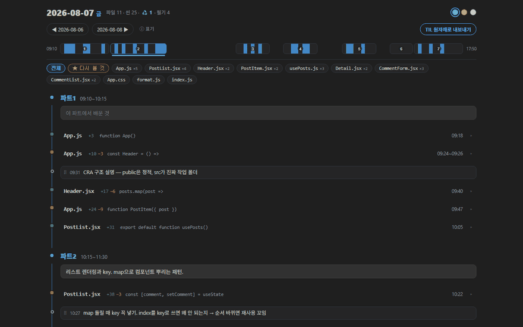

# 수업 리플레이 (Lesson Replay)

[](https://marketplace.visualstudio.com/items?itemName=bapzzi.lesson-replay)

## 목적
코드를 저장할 때마다 자동 기록해 하루를 타임라인으로 복기하는 VS Code 확장(마켓플레이스 배포, bapzzi/lesson-replay). 수업·독학·어떤 언어든.

## 현재상태 (2026-10-02)
v2.0.0(마켓 공개 2026-10-02). 1.5.0(기록 켜기 안정화·IntelliJ 병행·IDE 마감 화면)은 커밋 4bdf64a. 2.0 ① = 시간표 없는 자동 세션·필기 틀·내보내기 개편·언어 대응·문법 색칠. 설계 = `docs/specs/2026-10-02-v2-generalize-design.md`.

## 다음 할 일
- 2.0.0을 쓰며 불편을 모은다. 마켓 설명 = `MARKETPLACE.md`(캡처 `images/` = 10-02 데모 하루).
- 다음 단계: ② 영어 표시, ③ AI 요약(각각 별도 spec).

[](https://marketplace.visualstudio.com/items?itemName=bapzzi.lesson-replay)
[](LICENSE)

**▶ 설치: [VS Code 마켓플레이스](https://marketplace.visualstudio.com/items?itemName=bapzzi.lesson-replay)**

**오늘 무엇을 어떤 순서로 만들었는지** 자동 기록하고, 하루를 타임라인으로 복기하는 VS Code 확장. 부트캠프·강의 수업이든 혼자 하는 공부든, 어떤 언어든.

- 저장(`Ctrl+S`)할 때마다 스냅샷 자동 기록. 공부 중 할 일 없음
- 시간표가 있으면 파트(1교시·2교시…)로, 없으면 쉰 시간을 기준으로 세션이 자동으로 나뉨
- 나만의 필기 틀(`_틀.md`)로 매일 같은 모양의 필기
- IntelliJ 같은 다른 IDE에서 저장한 코드·필기도 기록. VS Code는 필기 폴더만 열어 두면 됨
- 필기를 적으면 적은 시각의 코드 사이에 교차 표시
- 지웠다 다시 만든 흔적(♻️)은 전후 비교로 복기
- 하루치를 md로 내보내기: 맨 위 한눈에 표·흐름만 읽어도 오늘 한 일이 보이고, diff는 부록으로. AI에 붙여넣으면 TIL 초안. VS Code 없이 명령줄로도 가능
- diff는 줄 번호와 문법 색칠(Java·Python·JS·SQL 등 36개 언어)
- 서버·계정 없음. 데이터는 전부 내 폴더 안의 git·md 파일



## 비슷한 도구와 뭐가 다른가

| 다른 도구에서 겪는 일 | 수업 리플레이 |
|---|---|
| VS Code Timeline: 파일 하나의 이력만 | **하루 단위**: 시간표 위에 전체 파일+필기 재구성 |
| GitLens: 설치하면 에디터에 표시가 침범, 끄려면 설정 수십 개 | 에디터 본문에 아무것도 안 얹음. 복기는 별도 탭 |
| WakaTime: 계정 가입 + API 키 필요 | 계정·서버·키 없음 |
| CodeTour: 투어를 손으로 만들어야 함 | **기록이 전자동**. 만들 게 없음 |

## 설치

- 확장 탭(`Ctrl+Shift+X`)에서 **"수업 리플레이"** 검색 → 설치 (vsix 파일이면 `Ctrl+Shift+P` → "Install from VSIX")
- git 필요: `git --version`으로 확인, 없으면 https://git-scm.com
- git이 처음이면: `git config --global user.name "이름"` · `git config --global user.email "메일"`

## 시작 (한 번만)

1. 공부하는 폴더 열기. ⚠ **개인 연습 저장소 전용**. git 저장소가 아니면 사이드바 [git 저장소 만들기] 클릭
2. 시작 안내(또는 명령 팔레트)에서 고르기
   - **시간표가 있는 수업**: 설정(`Ctrl+,`)의 `lessonReplay.blocks`를 내 시간표로 변경(기본값은 예시 7칸)
   - **자유 학습**: 시간표를 비우고 자동 세션으로(`lessonReplay.sessionGapMinutes`, 기본 30분)
3. 하단 상태바 `⊘ 기록 꺼짐` 클릭 → 기록 켜기 (켜는 동안 「기록 켜는 중」 표시)
4. (선택) 사이드바 「오늘 필기」 옆 버튼 → **필기 틀 편집**. `{날짜}` `{요일}` `{파트}` 자리표시를 쓸 수 있음

사고 방어 내장: 원격 연결 저장소는 켜기 전 1회 확인 · CRA 등이 만드는 중첩 git 저장소 감지 경고 · node_modules 자동 .gitignore · 남은 `index.lock` 자동 정리(git 작업이 없을 때만)

## 상태바 (좌하단)

| 표시 | 뜻 |
|---|---|
| `⊘ 기록 꺼짐` | 기록 안 함. 클릭=켜기 |
| `⏺ 기록중` | 켜짐 |
| `⏺ 기록중 · 14:32 스냅샷` | 방금 스냅샷 저장됨 |
| `⚠ 기록 실패 · 14:32` | 커밋 실패. 마우스를 올리면 원인(잠금·권한·git 없음), 알림의 "로그 보기"로 자세히 |
| `⚠ 기록 불가: git 저장소 아님` | 사이드바 [git 저장소 만들기] |

기록 상태는 이 컴퓨터에만 저장된다. 저장소를 공유해도 남의 VS Code에서 켜지지 않는다. 켜기에 실패하면 꺼짐으로 되돌리고 원인과 [다시 시도]를 띄운다.

## 하루 흐름

- **시작 전**: 상태바 `⏺` 확인 → 사이드바 **오늘 필기**를 한쪽에 열어 두기(시간표가 있으면 평일 아침, 없으면 그날 첫 저장 때 자동 생성)
- **공부 중**: 코딩+저장만. 강사 설명 때 필기 파일의 해당 파트 아래 **한 줄** 적고 저장하면 시각이 자동 기록됨. 필기는 VS Code·IntelliJ·메모장 어디서 저장해도 된다
- **복기**: 사이드바에서 오늘 날짜 클릭 →
  1. 스탯 줄·미니맵으로 하루 조감
  2. 필요한 파트만 **＋ 배운 것**을 눌러 한두 줄 정리
  3. 스탯 줄 **갈아엎음 N** 클릭 → 갈아엎은 씬 전후 비교 (오늘의 트러블슈팅 소재)
  4. 빈 구간에 **＋ 필기** 보충, 다음에 또 볼 씬은 **☆ → ★** 표시 (★ 칩·사이드바에 모임)
  5. **파일 칩** 클릭 → 핵심 파일의 하루 성장만 모아 보기
- **TIL**: 레일 끝 **[TIL 원자재로 내보내기]** → `복기/날짜-복기.md`
  - 맨 위: 사실 한 줄(기록 시간·구간·파일·필기·가장 많이 바뀐 곳) → **한눈에** 표 → **흐름**(필기·코드 시간순) → **다시 볼 곳**(★·시행착오 후보)
  - 부록: A 파일별 하루 변화 · B 시행착오 후보의 구간별 변화 · C 필기 전문
  - 통째로 AI에 붙여넣으면 TIL 초안. 프롬프트를 맨 위에 넣으려면 `lessonReplay.includeTilPrompt`

## 화면 요소

| 요소 | 동작 |
|---|---|
| 스탯 줄 (`파일 11 · 씬 25 · 갈아엎음 1`) | 갈아엎음 클릭=갈아엎은 씬으로 점프 |
| ◀ ▶ | 이전/다음 기록일 |
| 미니맵 | 파트 폭=수업 시간, 진할수록 활동 많음. 클릭=점프 |
| 파일 칩 (`PostList.jsx ×4`) | 클릭=그 파일 씬만 표시 (빈 파트 접힘) |
| 레일 표시 | 필기 = 원형 배지(연필), 코드 변경 = VS Code 아이콘(추가 ⊞ · 수정 ⊡ · 삭제 ⊟ · 갈아엎음 ⟳). 색은 탐색기의 git 색 |
| 씬 행 (`10:48 파일명 메서드 줄 … +12 −3`) | 행 클릭=변경 이력(줄 번호 diff) / **시각 클릭=그 시점 파일**(읽기 전용) / ☆ 클릭=★ 다시 볼 것 / 펼침 안 「diff 편집기로 열기」(VS Code 기본 diff)·「현재 파일 열기」 |
| 같은 파일 연속 씬 (`OpenAiService.java +153 −37 6구간`) | 한 줄로 묶임. 클릭=구간별로 펼침. 사이에 필기가 끼면 묶지 않음 |
| ★ 다시 볼 것 | 표시한 씬이 ★ 칩 필터와 사이드바 날짜 아래에 모임. 복습 큐 |
| ♻️ 씬 | 펼치면 지우기 전 판 ↔ 새 판 비교 |
| 일괄 작업 | 10개+ 파일 커밋 접힘. 클릭=목록 |
| ＋ 배운 것 | 파트별 메모, 자동 저장. 적은 파트만 펼쳐 보임 |
| 필기 | 시각 + 본문 한 줄. 클릭=수정 · ⠿ 드래그=이동 · ✕=삭제 · 레일 호버 ＋ 필기=추가 |

행의 버튼(다시 볼 것·시간 외로·숨기기)은 마우스를 올리거나 키보드로 행에 들어가면 보인다. ↑↓로 행 이동, Enter로 펼침.

## VS Code 없이 내보내기

```
node cli.js export 2026-10-05 --repo C:\inspire_6th
```

확장 폴더(`~/.vscode/extensions/bapzzi.lesson-replay-<버전>`)나 이 저장소에서 실행한다. 시간표·필기 폴더·아카이브 폴더는 VS Code 사용자 설정(`settings.json`의 `lessonReplay.*`)을 그대로 읽는다. 날짜를 빼면 오늘, `--repo`를 빼면 `archiveDir` 설정 폴더. 만든 파일 경로를 출력한다.

## FAQ

**"안쪽에 별도 git 저장소" 경고가 떠요**: CRA 등이 자동 `git init`한 것. 경고의 안내대로 안쪽 `.git` 폴더만 휴지통으로 (코드는 그대로).

**폴더를 바꿔 열면 기록이 꼬이나요?**: 기준은 연 폴더가 아니라 그 폴더가 속한 git 저장소 루트. 같은 저장소면 한곳에 모인다.

**IntelliJ로 코딩하면?**: 저장소 루트 전체를 직접 감시하므로 VS Code는 필기 폴더만 열어 두면 된다(`lessonReplay.watchRepoRoot`, 기본 켜짐). Java 프로젝트를 VS Code로 열지 않아도 된다.

**VS Code를 닫으면?**: 닫힌 동안은 기록 안 됨. 닫기 직전 저장분은 종료 시 남기려 시도하고, 실패하면 다음 첫 저장에 묶인다.

**확장을 지우면?**: 스냅샷=git 커밋, 필기=`필기\날짜.md`, 내보내기=`복기\날짜-복기.md`. 전부 남고, 어떤 서버로도 안 나간다.

## 설정

설정 화면에서 기록 / 시간표·필기 / 복기·내보내기 3묶음으로 보인다. 자주 바꾸는 것:

| 설정 | 기본 | 설명 |
|---|---|---|
| `blocks` | 예시 7블록 | 수업 시간표(=파트). **내 수업으로 변경**, 비우면(`[]`) 자동 세션 |
| `sessionGapMinutes` | 30 | 자동 세션: 이 시간(분)보다 오래 쉬면 새 세션 |
| `paragraphGapMinutes` | 3 | 이 텀(분) 넘게 쉬면 새 단락 |
| `tilPrompt` | 기본 프롬프트 | TIL 내보내기 상단 AI 요청문 |
| `commitDelaySeconds` | 20 | 저장 후 스냅샷까지 대기 |
| `watchRepoRoot` | 켜짐 | 저장소 루트 전체 감시(다른 IDE의 저장도 기록) |
| `noiseThreshold` | 10 | 이 수 이상 파일 커밋은 일괄 작업으로 뭉침 |
| `holidays` | `[]` | 필기 자동 생성 제외일 |
| `notesDir` | `필기` | 필기 폴더 이름 |
| `archiveDir` | 빈값 | 필기 보관 전용 폴더(저장소 밖이면 git 백업 제외) |

## 한계

- 기록 단위는 저장. 저장 사이에 썼다 지운 것은 안 남는다
- VS Code가 켜져 있는 동안만 기록
- 멀티 루트 워크스페이스는 첫 폴더만
- 날짜 목록은 내 커밋(git user.email)만 집계
- 기록 대상은 내 편집기. 강사 화면이 아니다

## 제거

확장 탭 → 제거. 코드·git 기록·필기·복기 전부 남는다.

---

## 개발

```
npm test                  # node --test
npm run package           # vsix 생성(마켓 설명 = MARKETPLACE.md, 저장소 README는 패키지에서 제외)
```

MIT License. diff 문법 색칠에 highlight.js(BSD-3-Clause, `media/vendor/highlight.js-LICENSE.txt`), 아이콘에 VS Code codicon(CC-BY-4.0)을 쓴다.
